<div align='center' >

 

</div>

# Medics City App

The Medics App is a comprehensive Flutter application designed to manage various aspects of merchandising and healthcare services. This app provides functionalities like medicine search, ordering medicine, appointment booking, messaging with doctors, and more, aiming to streamline and enhance the user experience.

---

✨ Apps Features

🌍  **Multi Language**

🌙 **Dark/Light mode**

💫 **Easy setup**

✅ **Easy to use**

👨‍💻  **ready for developers**

**Api 💨 https://github.com/hishaam6618/Medics_City_Api**

## Screenshoot  20+

### 🧑 User app

<p float="left">


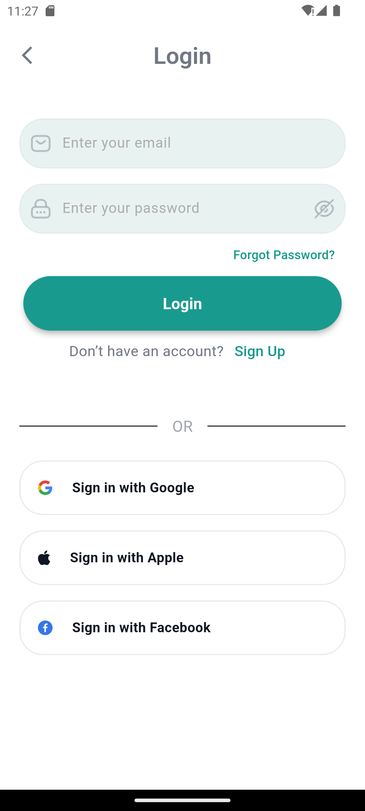

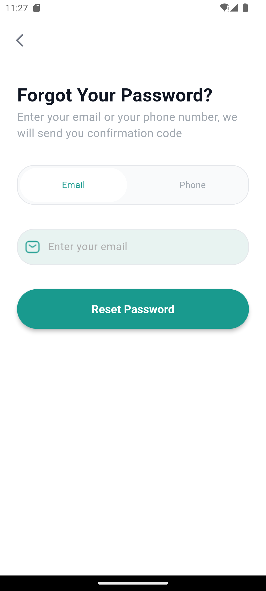
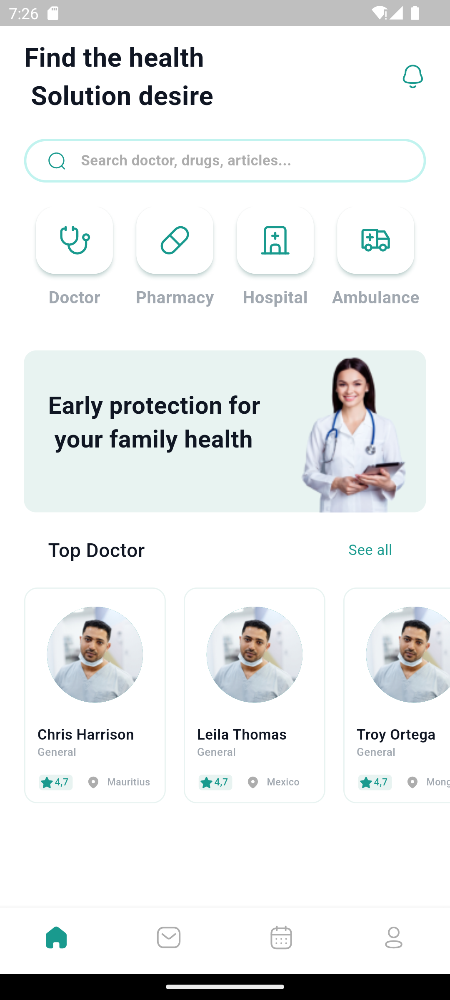
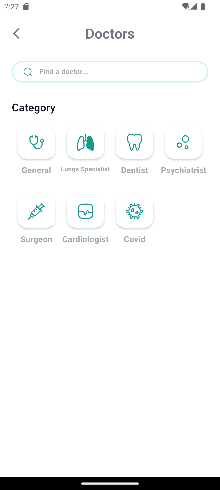
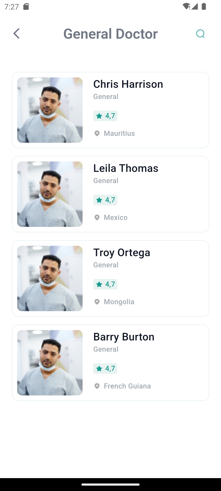
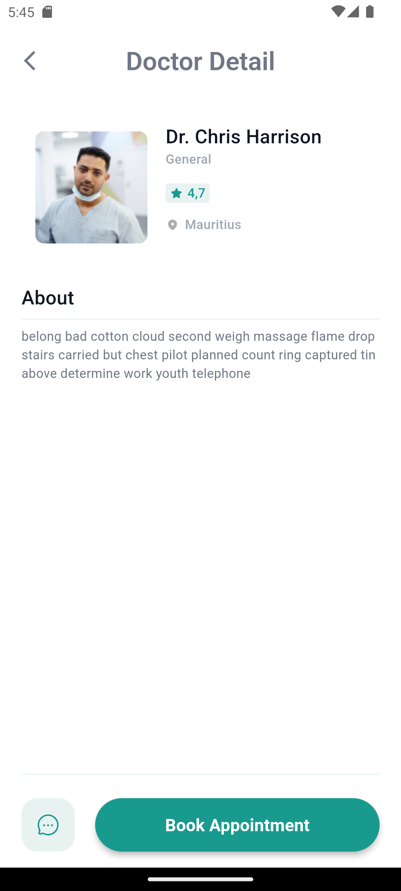
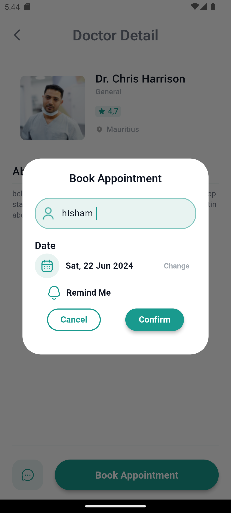
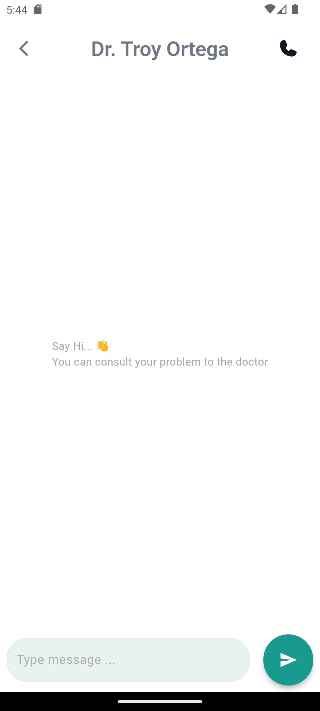


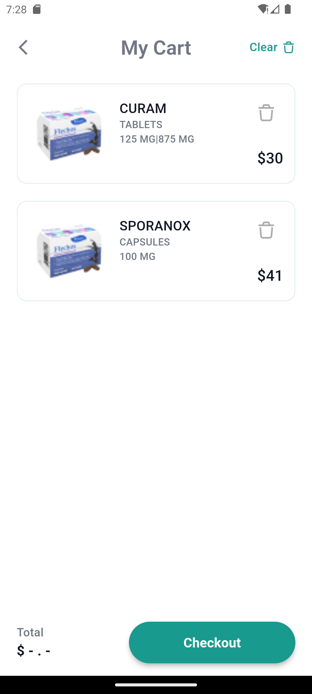

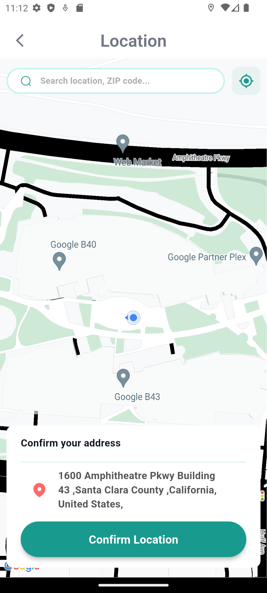
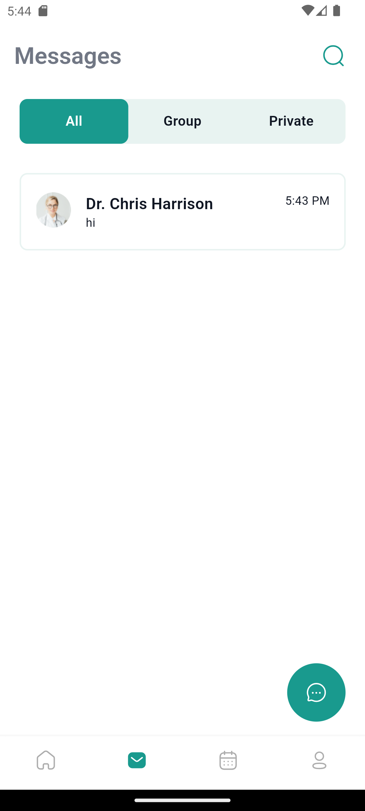
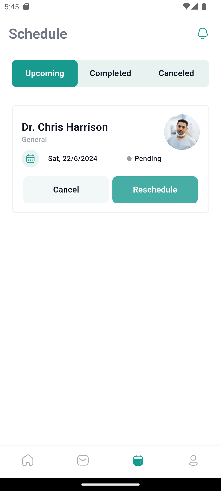
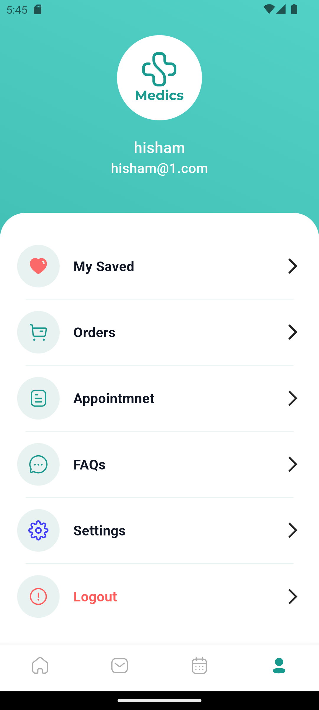

</p>

## Features

- **Medicine Search**: Quickly find information on medicines.
- **Order Medicine**: Place orders for medicines directly through the app.
- **Doctor Search**: Find and view profiles of doctors.
- **Book an Appointment**: Schedule appointments with healthcare providers.
- **Doctor Messaging**: Communicate directly with doctors through in-app messaging.
- **Hospital Search**: Locate nearby hospitals and view their details.
- **Ambulance Search**: Find and contact ambulance services.
- **Appointment Rescheduling**: Change appointment dates and times.
- **Appointment Reminders**: Set reminders before your appointments.
- **Language Change**: Switch between different languages.
- **Dark Mode**: Toggle between dark and light mode.

## Getting Started

### Prerequisites

- **Flutter SDK**: [Install Flutter](https://flutter.dev/docs/get-started/install)
- **IDE**: Android Studio or Visual Studio Code
- **Android SDK**: Ensure it's installed and configured

### Installation

1. **Clone the repository:**

    ```bash
    git clone https://github.com/hishaam6618/Medics_app.git
    cd Medics_app
    ```

2. **Install dependencies:**

    ```bash
    flutter pub get
    ```

3. **Run the app:**

    ```bash
    flutter run
    ```

## Project Structure

```bash
lib/
├───controller
├───core/
│   ├───class
│   ├───constant
│   ├───error
│   ├───functions
│   ├───localization
│   ├───services
│   └───shared
├───data/
│   ├───dataSoureces/
│   │   ├───localDataSource
│   │   └───remoteDataSource
│   ├───model
│   └───repositories
├───middleware
└───view/
    ├───widget
    └─────screen/
           ├───auth
           ├───onBording
           ├────home
           ├───ambulance
           ├───chats
           ├───doctors
           ├───drugs
           ├───hospital
           ├───location
           ├───notifications
           ├───order
           ├───profile
           └───Schedule
       
```

## Services

- **Search for a Doctor**: Easily find and view doctor profiles based on specialty, location, and availability.
- **Message a Doctor**: Use the in-app messaging system to communicate securely with your doctor.
- **Book an Appointment**: Schedule appointments directly through the app with your chosen healthcare provider.
- **Reschedule Appointments**: Change your appointment dates and times if needed.
- **Appointment Reminders**: Set and receive reminders before your scheduled appointments.
- **Order Medication**: Place orders for required medicines directly through the app.
- **Search for a Hospital**: Locate nearby hospitals, view their profiles, and get contact information.
- **Search for an Ambulance**: Find and request ambulance services quickly in case of emergencies.
- **Change Language**: Switch between different languages as per your preference.
- **Dark Mode**: Toggle between dark and light mode to enhance user experience based on lighting conditions.

## Usage

### Medicine Search

- Navigate to the Medicine Search screen to find detailed information about various medicines.

### Order Medicine

- Use the Order Medicine feature to place orders for required medicines directly through the app.

### Request a Medicine

- Submit requests for specific medicines not currently available in the inventory.

### Doctor Search

- Search for doctors based on specialty, location, and availability.

### Book an Appointment

- Schedule appointments directly through the app with your chosen healthcare provider.

### Doctor Messaging

- Use the in-app messaging system to communicate securely with your doctor.

### Hospital Search

- Locate nearby hospitals, view their profiles, and get contact information.

### Ambulance Search

- Find and request ambulance services quickly in case of emergencies.

### Appointment Rescheduling

- Reschedule your appointments if necessary by choosing new dates and times.

### Appointment Reminders

- Set reminders to ensure you never miss your appointments.

### Language Change

- Switch between different languages according to your preference.

### Dark Mode

- Toggle between dark and light mode for a better visual experience.

#  🛠Quick Setup (Make each app separately)

### Change **app name**

```javascript
on app directory open:  android/app/src/main/AndroidManifest.xml

on <application ...> edit android:label="YOUR APP NAME"
```

###  Change **app colors**

```javascript
on app directory open:  lib/core/constant/app_color.dart

go to line to this two line and edit 

  static const mainColor = Color(0xff199A8E); 
  static const mainColor2 = Color(0xffE8F3F1); 
  static const mainColor3 = Color(0xffC1F3EF); 
```

## Contributing

We welcome contributions! Please follow these steps:

1. **Fork the repository**
2. **Create a new branch** (`git checkout -b feature/your-feature`)
3. **Commit your changes** (`git commit -am 'Add a new feature'`)
4. **Push to the branch** (`git push origin feature/your-feature`)
5. **Create a new Pull Request**

## Issues

If you encounter any issues or have suggestions for improvements, please open an issue in the [Issues section](https://github.com/hishaam6618/Medics_app/issues).

## License

This project is licensed under the MIT License. See the [LICENSE](LICENSE) file for more details.

## Contact

For any inquiries or support, please contact Hisham Alyas at [hishaam.elyas@gmail.com](mailto:hishaam.elyas@gmail.com).

---

Thank you for using the Merchandiser Super App! We hope this application enhances your merchandising and healthcare management experience.
